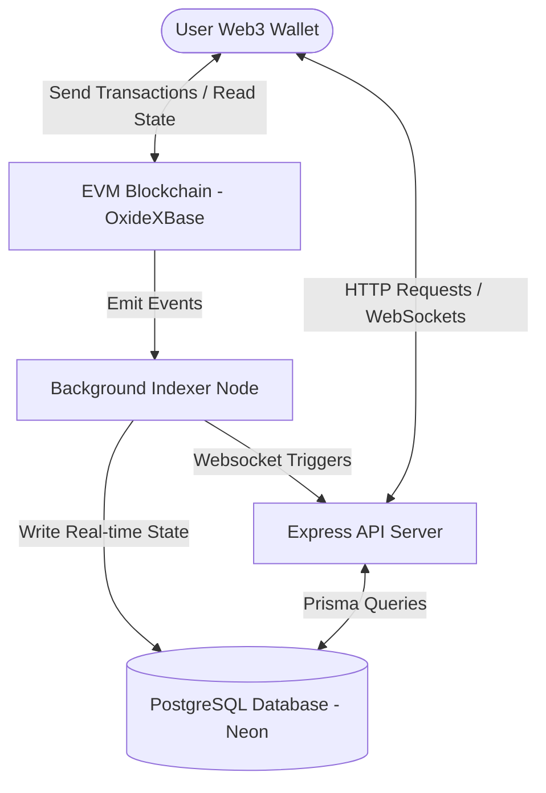

# OXIDEX — Decentralized Matrix Platform

OXIDEX is a 100% decentralized, fully autonomous smart contract matrix marketing platform running on EVM-compatible networks. Built with complete transparency, peer-to-peer automatic payment routing, and zero administrative intervention.

---

## 📊 Platform Architecture & Data Flow

OXIDEX is structured as a robust, hybrid dApp that combines on-chain smart contract execution with a high-performance database caching indexer to provide a lag-free user experience.



---

## 🛠 Project Components

The monorepo contains three core directories:

1.  **`/blockchain`**: Hardhat project hosting the `OxideXBase.sol` smart contract, deploy scripts, and automated unit tests.
2.  **`/backend`**: Node.js, Express, and Prisma setup running the background blockchain indexer and providing the statistics API.
3.  **`/frontend`**: Vite & React dashboard using Tailwind CSS style configurations and `ethers.js` to interact with both the blockchain and the indexer.

---

## 🔄 Matrix Programs Deep-Dive

OXIDEX operates three independent matrix structures simultaneously. When a user registers (0.075 ETH cost), Level 1 of all three programs is automatically activated.

| Matrix Program | Structure | Revenue Model | Ideal For |
| :--- | :--- | :--- | :--- |
| **X2 Matrix** | 1 Row, 2 Slots | Slot 1: 100% Direct Pay<br>Slot 2: Reinvests (Pays Upline) | High-speed cycles & quick entry |
| **X3 Matrix** | 1 Row, 3 Slots | Slots 1-2: 100% Direct Pay<br>Slot 3: Reinvests (Pays Upline) | Active builders & sponsors |
| **X4 Matrix** | 2 Rows, 6 Slots | Row 1: Pays Upline<br>Row 2 (Slots 1-3): 100% Direct Pay<br>Slot 4: Reinvests (Pays Upline) | Passive spillover & team structures |

### 1. X2 Program Mechanics (2 Slots)
```
     [ YOU ]
     /     \
  [P1]     [Recycle]
(100% Pay) (To Upline)
```

### 2. X3 Program Mechanics (3 Slots)
```
        [ YOU ]
      /    |    \
   [P1]   [P2]   [Recycle]
   (100% Payments) (To Upline)
```

### 3. X4 Program Mechanics (6 Slots)
```
          [ YOU ]
         /       \
      [F1]       [F2]      <--- Row 1 (Payments go to Upline)
     /   \       /   \
  [S1]   [S2]  [S3]  [Recycle] <--- Row 2 (Slots 1-3 pay YOU, Slot 4 recycles)
```

---

## 🛡 Security Protections

*   **DoS Bounded Lookup**: On-chain referrer searching has a hardbound limit of 30 parent elements to prevent contract execution from failing due to out-of-gas errors.
*   **Anti-Contract Register Check**: Only Externally Owned Accounts (EOA) can register (`msg.sender == tx.origin`).
*   **Strict CORS Policy**: CORS limits browser origins strictly to the specified whitelist (supporting automatic trailing slash sanitization).
*   **API Rate Limiters**: Built-in rate limiters restrict global request counts to 100 per 15 minutes, and authentication actions to 20 per 15 minutes.
*   **Nonce Expiry & Storage TTL**: Login nonces expire after 10 minutes to prevent memory leaks and protect against replay attacks.

## 🚀 Live Deployment
The smart contract has been successfully deployed to the **Sepolia Testnet**.
- **Contract Address:** `0xF79A892eaF3D1085c1a4Da364881DF2240D29F4d`
- **Frontend URL:** Hosted on GitHub Pages
- **Backend API:** Hosted on Render (`https://oxidex-api.onrender.com`)

---

## ⚙ Setup & Installation

### Prerequisites
*   Node.js v18+
*   PostgreSQL Database instance
*   MetaMask Wallet with Sepolia Testnet ETH

### Sub-project Configurations
Follow the setup instructions in each directory:
1.  **Blockchain (`/blockchain`)**:
    - Create a `.env` file and add your `PRIVATE_KEY=your_metamask_key` (Make sure your wallet has Sepolia ETH).
    - Run `npx hardhat compile` and `npx hardhat run scripts/deploy.js --network sepolia` to deploy.
2.  **Backend (`/backend`)**:
    - Setup `/backend/.env` with your Neon database credentials, `RPC_URL`, and the new `CONTRACT_ADDRESS`.
    - Run `npx prisma db push` to generate client mappings, and launch your API.
3.  **Frontend (`/frontend`)**:
    - Update the contract address in `src/utils/contract.js`.
    - Run `npm run build` and `npm run deploy` to publish to GitHub Pages.
