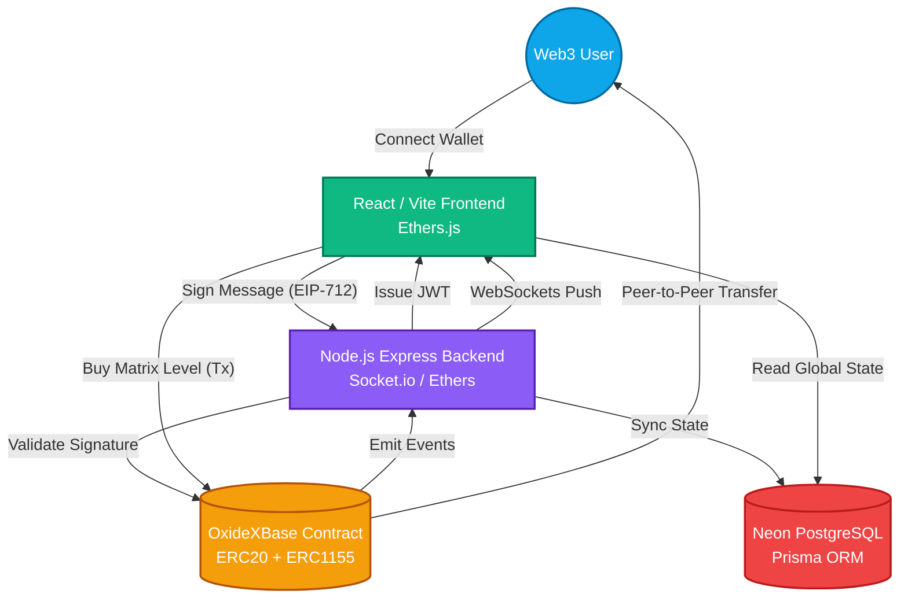
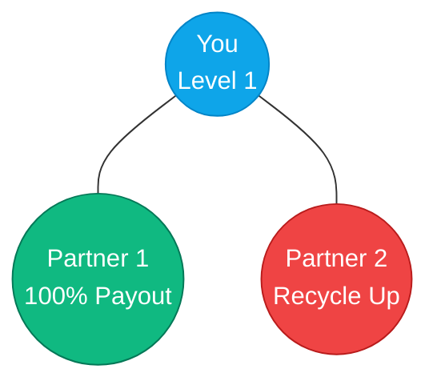
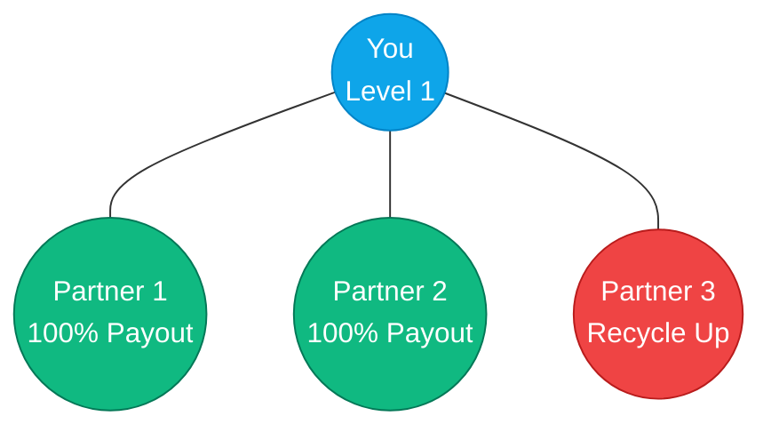
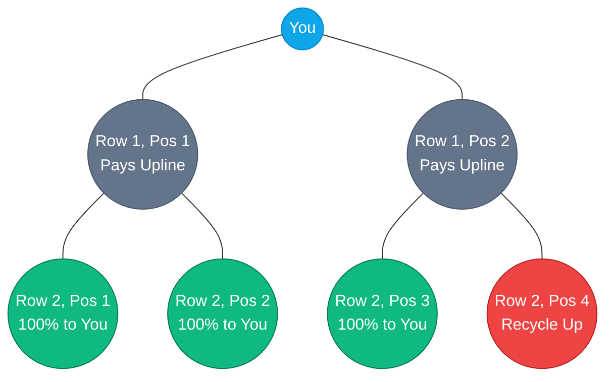
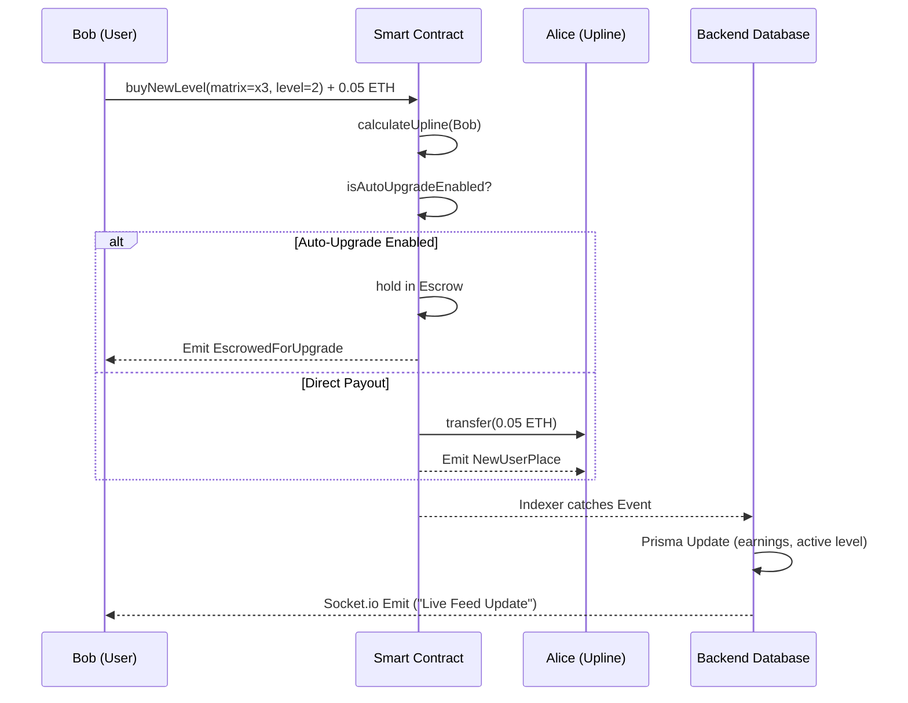

<div align="center">

# ⚡ OXIDEX PROTOCOL ⚡
**The Autonomous, Peer-to-Peer Decentralized Matrix Network**

[](https://opensource.org/licenses/MIT)
[](https://sepolia.etherscan.io/)
[](https://nodejs.org/)
[](https://reactjs.org/)
[](https://soliditylang.org/)
[](https://www.prisma.io/)
[](https://tailwindcss.com/)

<br>

<p align="center">
  <em>An unstoppable blockchain matrix marketing protocol designed for hyper-scalability, peer-to-peer instantaneous payments, and autonomous level-ups. Zero human administration. Absolute transparency.</em>
</p>

---

</div>

<br>

## 🌌 Protocol Infographic & High-Level Architecture

The OXIDEX ecosystem is built upon a tri-layer architecture consisting of a **Web3 Frontend**, a **Real-time Backend Node**, and the **EVM Smart Contracts**.



<br>

## 📊 The Tri-Matrix System (x2, x3, x4)

OXIDEX deploys three separate network matrices, each with its own mathematical progression algorithm. Members can upgrade levels in each matrix to capture higher referral value.

### 1. The X2 Matrix (Linear Velocity)

> **Mechanics:** 1-row, 2-slot board. The first placement directly pays you 100%. The second placement pays your upline and automatically clears (recycles) your board so you can earn again.

<br>

### 2. The X3 Matrix (Network Builder)

> **Mechanics:** 1-row, 3-slot board. The first two placements directly pay you 100%. The third placement pays your upline and recycles your board.

<br>

### 3. The X4 Matrix (Team Spillover)

> **Mechanics:** 2-row, 6-slot board. Row 1 payments pass up. Row 2 positions 1, 2, and 3 pay you 100%. Position 4 recycles the board.

<br>

## 🔐 Core Features & Security Implementations

| Feature Matrix | Implementation Details | Security Standard |
|----------------|------------------------|-------------------|
| **P2P Payments** | Payments never touch a central treasury. | Fully Decentralized |
| **Auto-Escrow** | Smart contract holds partial funds to automatically buy next levels. | Non-custodial |
| **Token Rewards** | Users get ERC20 ($OXI) when they register and recruit. | OpenZeppelin ERC20 |
| **Soulbound NFTs** | Reach level 3, 6, 9 to mint non-transferable milestone NFTs. | ERC1155 (Locked) |
| **JWT Off-Chain** | Signatures verify wallet ownership before granting dashboard access. | EIP-712 / Ethers |
| **WebSockets** | Live network feed without constantly querying the blockchain RPC. | Socket.io / EventLog |

<br>

## 🛠 Project Monorepo Structure

The project is broken into three distinct workspaces. Follow the `README.md` files inside each respective directory for hyper-detailed instructions.

```text
OXIDEX/
├── blockchain/         # Hardhat, Solidity 0.8.20+, OpenZeppelin
│   ├── contracts/      # OxideXBase.sol, OxiToken.sol, OxiMilestones.sol
│   ├── scripts/        # deploy.js (Linking logic)
│   └── test/           # Chai / Mocha unit tests
│
├── backend/            # Node.js, Express, Prisma ORM, Socket.io
│   ├── prisma/         # schema.prisma (Neon Postgres)
│   ├── src/
│   │   ├── services/   # indexer.js (Blockchain listener)
│   │   ├── controllers/# analyticsController.js, authController.js
│   │   └── app.js      # Main Express API entry
│   └── seed_owner.js   # Master Account injection script
│
└── frontend/           # React 18, Vite, Tailwind CSS, Lucide Icons
    ├── src/
    │   ├── context/    # Web3Context.jsx (Ethers.js provider)
    │   ├── pages/      # Dashboard, Leaderboard, AffiliateHub
    │   └── components/ # Sidebar, Modals, Real-time feeds
    └── index.html      # Vite Entry point
```

<br>

## 🚀 Deployment (Render + GitHub Pages)

This project is optimized exclusively for production environments without the need for local blockchain configurations.

- **Backend (Render)**: Set your root directory to `backend/` in Render dashboard. Render will automatically install dependencies and run `npm start` (which handles Prisma generation and runs the Express server).
- **Frontend (GitHub Pages)**: Navigate to the `frontend/` directory and run `npm run deploy`, or run `npm run deploy:frontend` from the root. This pushes the optimized production build to the `gh-pages` branch.

<br>

## ⚡ Step-by-Step Installation

### Prerequisites
- [Node.js v18+](https://nodejs.org/)
- [MetaMask Wallet](https://metamask.io/) installed in your browser
- A PostgreSQL Database (e.g. [Neon](https://neon.tech/))
- Sepolia Testnet ETH

### 1. Blockchain Deployment
```bash
cd blockchain
npm install
# Add your ALCHEMY_URL and PRIVATE_KEY to .env
npx hardhat compile
npx hardhat run scripts/deploy.js --network sepolia
```
*Copy the deployed contract addresses. You will need them for the frontend and backend.*

### 2. Backend Initialization
```bash
cd backend
npm install
# Add DATABASE_URL, CORS_ORIGIN, JWT_SECRET, PRIVATE_KEY to .env
npx prisma generate
npx prisma db push
node seed_owner.js
npm run dev
```

### 3. Frontend Execution
```bash
cd frontend
npm install
# Add VITE_BACKEND_URL and update CONTRACT_ADDRESS in utils/contract.js
npm run dev
```

<br>

## 💸 Economic Data Flow Diagram

Understanding the flow of Ether through the system is critical.



<br>

## 🛡 Security Audits & Known Vectors

- **Reentrancy**: Mitigated using OpenZeppelin `ReentrancyGuard` on all state-mutating, value-transferring functions.
- **Gas Limits**: Reinvestment loops are strictly capped at mathematical limits, heavily tested to prevent Out-Of-Gas (OOG) reverts on deeply nested matrices.
- **Admin Keys**: The owner account is initialized at deploy time, but the contract features **ZERO** pause, withdrawal, or administrative override functions. Once deployed, the matrix is unstoppable.
- **Token Emissions**: $OXI Token minting is strictly regulated by the `OxideXBase` contract acting as the sole authorized minter.

<br>

## 🚀 Live Roadmap

- [x] **Phase 1**: Core Matrix Smart Contracts (x3, x4)
- [x] **Phase 1.5**: ERC20 Token & ERC1155 Soulbound NFT Integration
- [x] **Phase 2**: Backend Indexer, Neon DB Integration, API Routes
- [x] **Phase 2.5**: Telegram Webhook Community Alerts
- [x] **Phase 3**: Trust-Incurred UI Overhaul (Sky Blue/Emerald Theme)
- [x] **Phase 3.5**: Affiliate Hub & Global Analytics Leaderboard
- [ ] **Phase 4**: Mainnet Deployment & External Security Audit
- [ ] **Phase 5**: Cross-Chain Bridging (Arbitrum & Polygon)

<br>

<div align="center">
  <b>Built with ❤️ for the decentralized future.</b><br>
  For questions, please refer to the specific workspace READMEs.
</div>
