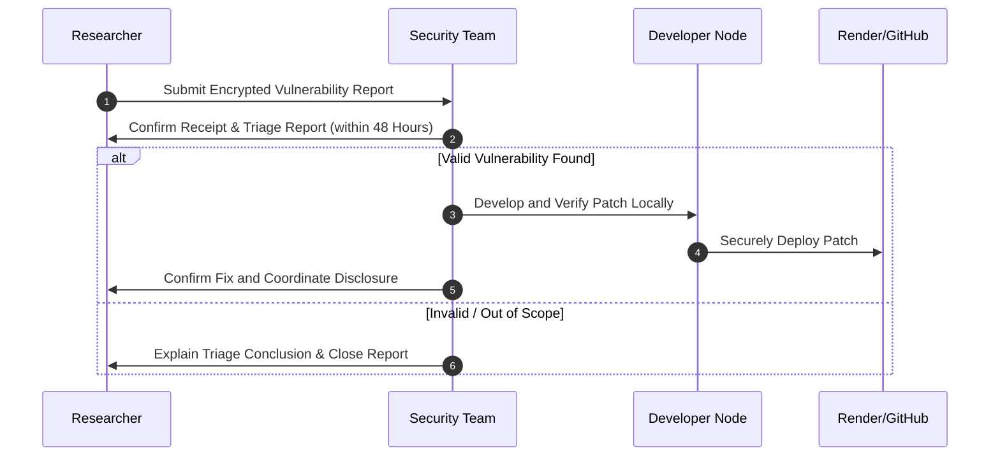

# Security Policy and Disclosure Guidelines

OXIDEX is committed to maintaining a secure ecosystem. Since our platform consists of immutable smart contracts holding user transactions, we place the highest priority on identifying, mitigating, and fixing bugs across our code repository.

---

## 🔍 Scope of Security Audit

Our security policy governs all directories in this monorepo, covering three core vectors:

```
[On-Chain Assets]          [Ingestion Layer]          [Client Application]
OxideXBase.sol     --->    Node.js Indexer     --->   React Frontend
(Solidity Contract)        (Prisma / Database)        (Ethers.js / Auth Nonces)
```

1.  **On-Chain Layer (`/blockchain`)**: Smart contract logic, reinvest loops, gas limit boundaries, access controls, and payment routing.
2.  **Ingestion & State Layer (`/backend`)**: API middleware security, database connection pooling, reorg-safe block indexing, CORS policies, JWT signature verifications, and rate limit protections.
3.  **Client Application Layer (`/frontend`)**: Input sanitization, wallet connection security, and view-only preview state sanitation.

---

## 📊 Severity Classification Matrix

We evaluate security vulnerabilities based on their impact on fund security, server availability, and user data privacy:

| Severity | Description / Example | Action Requirement |
| :--- | :--- | :--- |
| **Critical** | Reentrancy attacks, referral path bypasses, or logic errors that block peer-to-peer ETH payouts. | Immediate hotfix / contract migration warning. |
| **High** | Reorg-handling failures leading to double-indexed earnings, indexer memory exhaustion, or JWT validation bypasses. | Fix and deploy within 24 hours. |
| **Medium** | CORS validation bypasses, rate limiter evasion, database connection leaks, or missing frontend validation checks. | Patched in the next scheduled release cycle. |
| **Low** | Slow queries, front-end visual issues, log pollution, or minor outdated package versions. | Handled via normal issue tracking. |

---

## 🔄 Vulnerability Management Lifecycle

If you discover a vulnerability, please follow our responsible disclosure lifecycle to ensure it is mitigated before it becomes public knowledge:



### 1. How to Submit a Report
*   **Do not open a public issue.**
*   Send a detailed vulnerability report to our support email or security team contact.
*   Include steps to reproduce, code snippets, or transaction hashes (if on testnet), and your recommended remediation steps.

---

## 🛡 Safe Harbor Rules

To protect security researchers, we promise **not to initiate legal action** against you, provided that:

1.  You do not exploit the security issue to extract real funds, disrupt service, or access other users' transaction data.
2.  You give us a reasonable amount of time to investigate and patch the issue before making it public.
3.  You comply with all relevant local laws regarding authorization limits on your own local blockchain networks or testnets during analysis.
