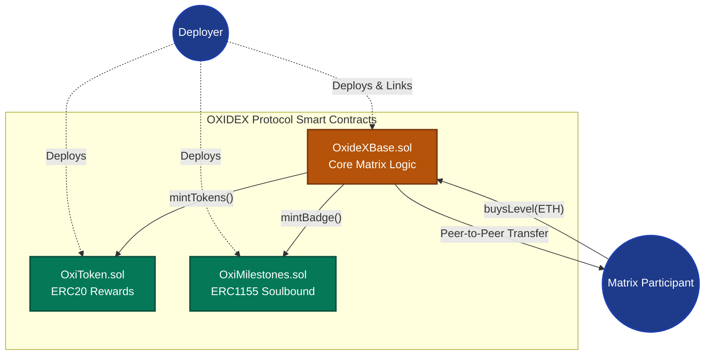
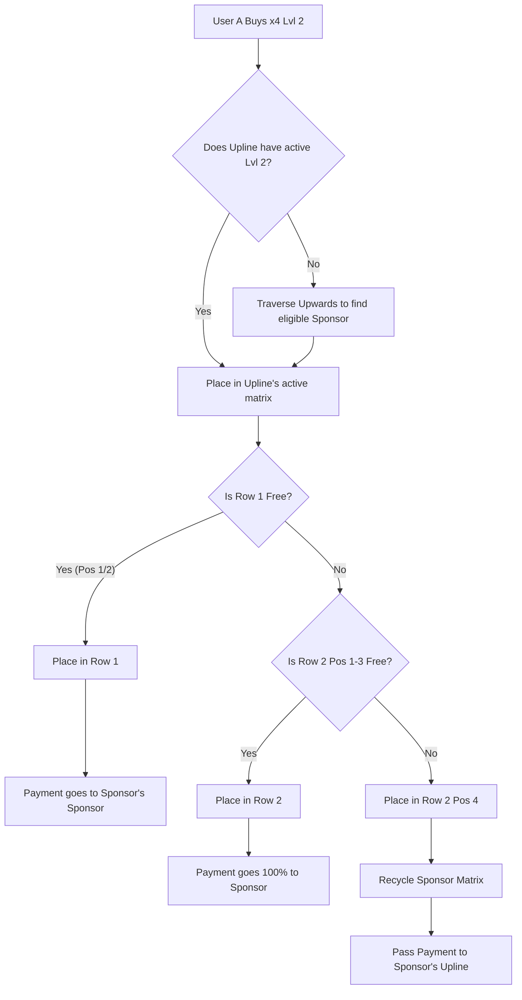

<div align="center">

# ⛓️ OXIDEX Smart Contract Architecture ⛓️

[](https://soliditylang.org/)
[](https://hardhat.org/)
[](https://openzeppelin.com/)

*The decentralized, immutable, and autonomous core of the OXIDEX Protocol.*

</div>

---

## 🏗 System Architecture Diagram



<br>

## 📜 Contract Specifications

### 1. `OxideXBase.sol`
This is the master contract controlling the x2, x3, and x4 matrices.

#### Storage Variables
| Variable | Type | Description |
|----------|------|-------------|
| `users` | `mapping(address => User)` | Stores global user state (id, referrer, partner counts) |
| `idToAddress` | `mapping(uint => address)` | Reverse lookup from ID to EVM Address |
| `lastUserId` | `uint` | Counter tracking total registered members |
| `levelPrice` | `mapping(uint8 => uint)` | Cost (in wei) for each matrix level (1-12) |
| `autoUpgradeEscrow` | `mapping(address => uint)` | User balance escrowed for automatic upgrades |
| `autoUpgradeEnabled` | `mapping(address => bool)` | Opt-in boolean flag for users |

#### State Modifying Functions
| Function Signature | Modifier | Emitted Event | Use Case |
|--------------------|----------|---------------|----------|
| `registrationExt(address referrerAddress)` | `payable`, `nonReentrant` | `Registration` | Main entry point for new users paying 0.075 ETH. |
| `buyNewLevel(uint8 matrix, uint8 level)` | `payable`, `nonReentrant` | `Upgrade` | Purchases higher matrix tier. |
| `toggleAutoUpgrade()` | `external` | `AutoUpgradeToggled` | User flips escrow mode ON/OFF. |
| `withdrawEscrow()` | `nonReentrant` | `EscrowWithdrawn` | Escapes funds from the contract if opted out. |

<br>

### 2. `OxiToken.sol`
The native ERC20 token acting as the protocol's reward layer.

| Feature | Description |
|---------|-------------|
| **Standard** | OpenZeppelin ERC20 |
| **Name / Symbol** | OxideX Token / OXI |
| **Total Supply** | Mintable (No cap, strictly regulated via access control) |
| **Access Control** | Only the linked `OxideXBase` contract has the `MINTER_ROLE`. Users cannot spoof mints. |

<br>

### 3. `OxiMilestones.sol`
The protocol's ERC1155 Soulbound Badge implementation.

| Token ID | Milestone Description | Rarity |
|----------|-----------------------|--------|
| `1` | **Level 3 Achiever** - Activated Level 3 in any Matrix | Common |
| `2` | **Level 6 Elite** - Activated Level 6 in any Matrix | Rare |
| `3` | **Level 9 Master** - Activated Level 9 in any Matrix | Epic |
| `4` | **Level 12 Legend** - Reached max level | Legendary |

*Note: The `safeTransferFrom` and `safeBatchTransferFrom` functions are overridden to strictly `revert`, enforcing the Soulbound nature.*

<br>

## 💸 X4 Matrix Placement Algorithm

The X4 Matrix logic is the most computationally heavy. It relies on a deterministic placement algorithm to find free slots in a 2-row (2x4) structure.



<br>

## 🚀 Deployment Guide (Hardhat)

### 1. Environment Setup
Create a `.env` file in the `blockchain/` directory:
```env
PRIVATE_KEY="your_wallet_private_key"
ALCHEMY_URL="https://eth-sepolia.g.alchemy.com/v2/YOUR_API_KEY"
ETHERSCAN_API_KEY="your_etherscan_api"
```

### 2. Compilation
Compile the Solidity contracts to generate ABIs and TypeChain typings.
```bash
npx hardhat compile
```

### 3. Running the Test Suite
The contract suite is heavily tested for edge cases involving overflow, reentrancy, and matrix recursion.
```bash
npx hardhat test
```
*Expected Output:*
```text
  OxideX Protocol
    Deployment
      ✔ Should deploy all three contracts
      ✔ Should set the correct owner
      ✔ Should link Token and NFT to Base
    Registration
      ✔ Should register the first user (Owner)
      ✔ Should revert if trying to register without 0.075 ETH
    Auto-Upgrade & Escrow
      ✔ Should accurately redirect funds to Escrow if toggled
      ✔ Should allow user to withdraw escrow manually
```

### 4. Deploying to Sepolia Testnet
The `deploy.js` script handles the 3-step deployment and the critical linking phase.

```bash
npx hardhat run scripts/deploy.js --network sepolia
```

*The script executes:*
1. Deploys `OxideXBase`.
2. Deploys `OxiToken`.
3. Deploys `OxiMilestones`.
4. Calls `OxiToken.setOxideXContract(baseAddress)`.
5. Calls `OxiMilestones.setOxideXContract(baseAddress)`.
6. Calls `OxideXBase.setInterfaces(tokenAddress, nftAddress)`.

### 5. Contract Verification
After deployment, wait 5 block confirmations, then verify on Etherscan:
```bash
npx hardhat verify --network sepolia <DEPLOYED_ADDRESS>
```

<br>

## 🛡 Security & Audit Notes

### Non-Custodial by Design
The `OxideXBase.sol` contract holds exactly **zero** ETH for normal operations. All matrix payments (registration and level upgrades) are processed and forwarded in the exact same transaction block. 

### Exception: The Escrow Feature
The only time the contract holds funds is via the `autoUpgradeEscrow` mapping. This is heavily protected by OpenZeppelin's `ReentrancyGuard`. Users maintain 100% sovereignty over these funds and can call `withdrawEscrow()` at any time to instantly pull their ETH back.

### Centralization Risks
- **Owner Privileges**: The contract has no `pause()`, `upgradeTo()`, or `withdrawAll()` functions. The owner only exists to seed the initial ID #1 into the matrix.
- **Immutability**: Once deployed, the logic cannot be altered by anyone, including the deployer.

<br>
<br>

<div align="center">
  <b>OxideX Blockchain Layer</b><br>
  *Trustless code running on the Ethereum Virtual Machine.*
</div>
