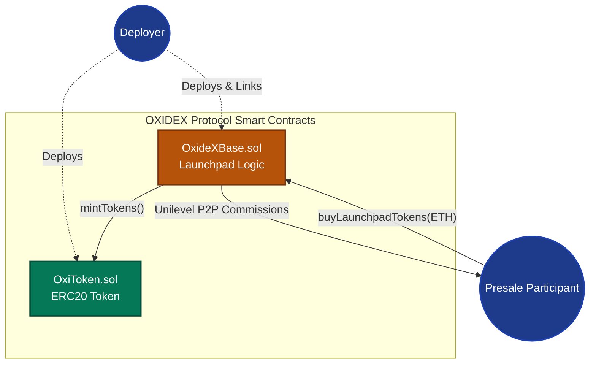
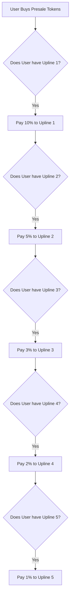

<div align="center">

# ⛓️ OXIDEX Smart Contract Architecture ⛓️

[](https://soliditylang.org/)
[](https://hardhat.org/)
[](https://openzeppelin.com/)

*The decentralized, immutable, and autonomous core of the OXIDEX Protocol.*

</div>

---

## 🏗 System Architecture Diagram



<br>

## 📜 Contract Specifications

### 1. `OxideXBase.sol`
This is the master contract controlling the Unilevel Token Launchpad.

#### Storage Variables
| Variable | Type | Description |
|----------|------|-------------|
| `users` | `mapping(address => User)` | Stores global user state (id, referrer, partner counts) |
| `idToAddress` | `mapping(uint => address)` | Reverse lookup from ID to EVM Address |
| `lastUserId` | `uint` | Counter tracking total registered members |
| `levelCommissions` | `mapping(uint8 => uint)` | Commission payout percentages for levels 1-5 |

#### State Modifying Functions
| Function Signature | Modifier | Emitted Event | Use Case |
|--------------------|----------|---------------|----------|
| `buyLaunchpadTokens(address referrer)` | `payable`, `nonReentrant` | `TokensPurchased` | Main entry point for buying tokens and paying upline. |

<br>

### 2. `OxiToken.sol`
The native ERC20 token for the launchpad.

| Feature | Description |
|---------|-------------|
| **Standard** | OpenZeppelin ERC20 |
| **Name / Symbol** | OxideX Token / OXI |
| **Total Supply** | Mintable (No cap, strictly regulated via access control) |
| **Access Control** | Only the linked `OxideXBase` contract has the `MINTER_ROLE`. Users cannot spoof mints. |

<br>

## 💸 5-Level Unilevel Commission Algorithm

The commission logic handles paying up to 5 levels of sponsors instantly.



<br>

## 🚀 Deployment Guide (Hardhat)

### 1. Environment Setup
Create a `.env` file in the `blockchain/` directory:
```env
PRIVATE_KEY="your_wallet_private_key"
ALCHEMY_URL="https://eth-sepolia.g.alchemy.com/v2/YOUR_API_KEY"
ETHERSCAN_API_KEY="your_etherscan_api"
```

### 2. Compilation
Compile the Solidity contracts to generate ABIs and TypeChain typings.
```bash
npx hardhat compile
```

### 3. Running the Test Suite
The contract suite is heavily tested for edge cases involving overflow, reentrancy, and commission recursion.
```bash
npx hardhat test
```

### 4. Deploying to Sepolia Testnet
The `deploy.js` script handles the deployment and the critical linking phase.

```bash
npx hardhat run scripts/deploy.js --network sepolia
```

### 5. Contract Verification
After deployment, wait 5 block confirmations, then verify on Etherscan:
```bash
npx hardhat verify --network sepolia <DEPLOYED_ADDRESS>
```

<br>

## 🛡 Security & Audit Notes

### Non-Custodial by Design
The `OxideXBase.sol` contract holds exactly **zero** ETH for normal operations. All commission payments are processed and forwarded in the exact same transaction block. 

### Centralization Risks
- **Immutability**: Once deployed, the logic cannot be altered by anyone, including the deployer.

<br>
<br>

<div align="center">
  <b>OxideX Blockchain Layer</b><br>
  *Trustless code running on the Ethereum Virtual Machine.*
</div>
