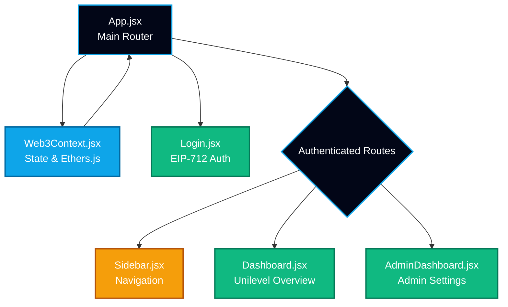
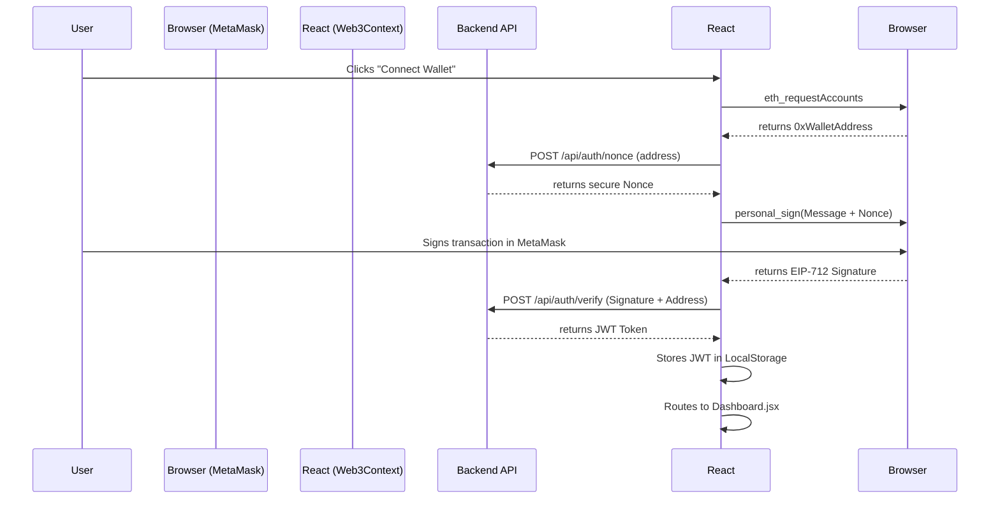

<div align="center">

# 🌌 OXIDEX Frontend Application 🌌

[](https://reactjs.org/)
[](https://vitejs.dev/)
[](https://tailwindcss.com/)
[](https://docs.ethers.org/)
[](https://reactrouter.com/)

*The high-performance, Web3-native user interface for the OXIDEX Protocol. Built with the "Trust-Incurred" design system.*

</div>

---

## 🎨 UI/UX Design System: "Trust-Incurred"

The frontend is styled using a custom Tailwind CSS configuration designed to elicit feelings of **Trust, Professionalism, and Autonomy**. We aggressively avoid "meme-coin" aesthetics in favor of bank-grade, neon-accented dark modes.

| Color Token | Hex Code | Purpose in UI |
|-------------|----------|---------------|
| **Deep Navy (Background)** | `#020617` | Main application background. Represents depth and security. |
| **Sky Blue (Brand/Trust)** | `#0ea5e9` | Primary accents, buttons, and links. Represents corporate trust and technology. |
| **Emerald (Success)** | `#10b981` | Positive P2P transactions, active levels, and successful Web3 connections. |
| **Amber (Warning/Preview)** | `#f59e0b` | View-only mode borders and registration calls-to-action. |
| **Slate (Text/Borders)** | `#cbd5e1` | Crisp, high-contrast readable text against the deep navy backdrop. |

<br>

## 🗺 Component Architecture

The React application utilizes a Context-driven architecture.



<br>

## 🔐 Authentication Flow (Web3 Context)

The OXIDEX frontend uses a completely passwordless, database-free authentication mechanism relying entirely on cryptography.



<br>

## 🚀 Key Pages & Features

### 1. `Dashboard.jsx`
- Automatically queries the connected wallet's statistics.
- Displays Unilevel network growth and presale token purchases.

### 2. `AdminDashboard.jsx`
- Admin settings and network tree viewers.

<br>

## ⚙️ Environment Configuration (`.env`)

Create a `.env` file in the `frontend/` directory:

```env
# URL for the Node.js Express Backend
VITE_BACKEND_URL="http://localhost:8080"
```

**Contract Address Configuration:**
After deploying the Smart Contracts, you must manually update the contract address inside `frontend/src/utils/contract.js`:
```javascript
export const CONTRACT_ADDRESS = "0xYourDeployedContractAddressHere";
```

<br>

## 🛠 Local Development Commands

### 1. Installation
Install the necessary React, Vite, and Ethers dependencies:
```bash
npm install
```

### 2. Running the Development Server
```bash
npm run dev
```
*Vite will start a blazing fast HMR server at `http://localhost:8000`.*

### 3. Production Build
```bash
npm run build
```
*Compiles the application into static assets located in the `dist/` directory. These assets can be hosted on Vercel.*

<br>

<div align="center">
  <b>OxideX Frontend Layer</b><br>
  *Bringing beautiful usability to complex smart contracts.*
</div>
